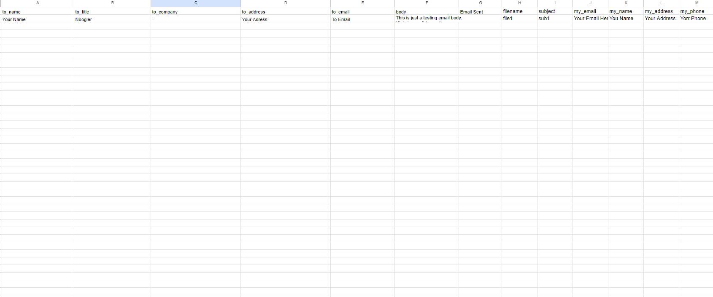
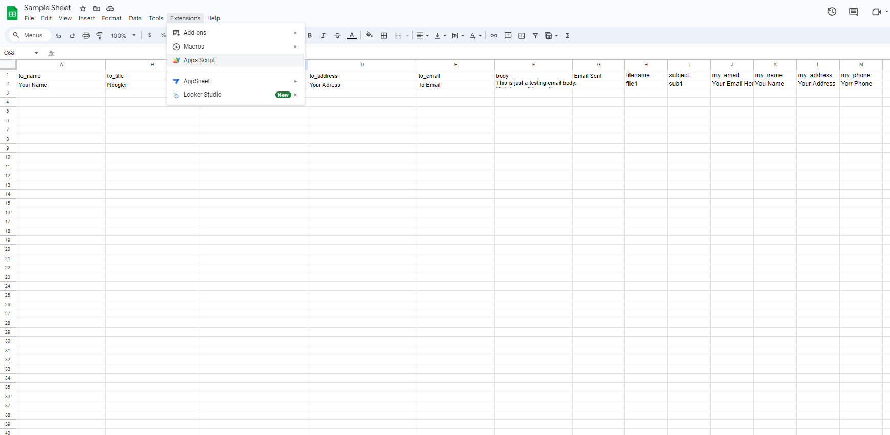
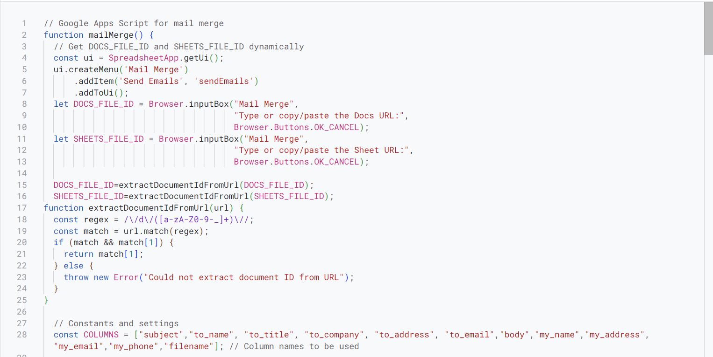
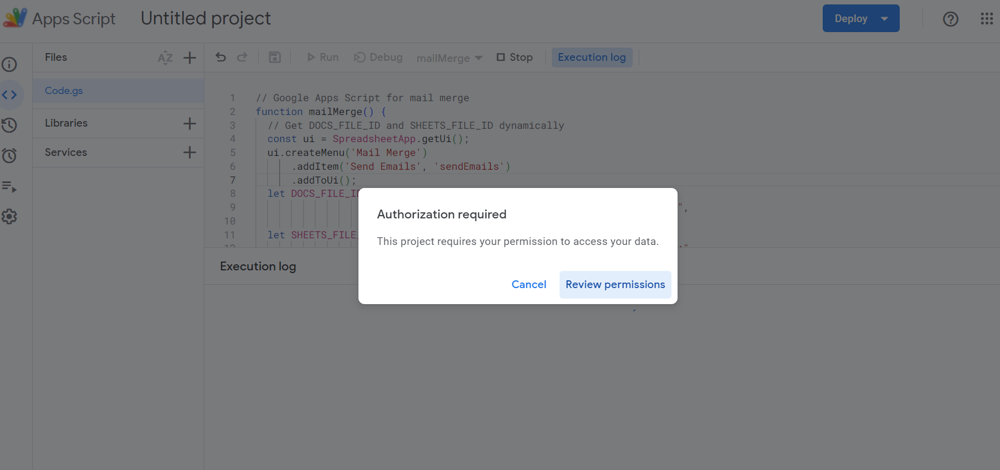

# Mail Merge

## Description:

Mail Merge is a powerful script designed to streamline your email communication process. With this tool, you can effortlessly send personalized emails along with attached documents in PDF format to a large number of recipients listed in your Excel or Spreadsheet. This script is not only easy to use but also completely free, allowing you to send emails with unlimited tokens. Say goodbye to manual email sending and enjoy the efficiency of Mail Merge for all your bulk email needs.

## Demo Video:

[Demo.webm](https://github.com/Ashwani2529/Mail_Merge/assets/91582711/9d1166fb-912c-4317-9902-48382e22b89e)

## How to Use Mail Merge

1. Clone this repo.

2. Open [App Script](https://www.google.com/script/start/) in your browser and sign in to start a new code session.

3. Open Excel in Google Docs.

4. Upload the sample spreadsheet to your Google Spreadsheet page.

5. Upload the sample documents to your Google Docs page.

6. Edit all the details except the "Email Sent" cell; leave that cell blank.

7. After filling in the details, open the Extensions menu and click on App Script.

8. Paste the content of the Mail_Merge.gs file here. It will look something like this:

9. Click on Save Project.

10. Run the code.

11. Click on Review Permissions.

12. Authorize the request, click on "Go to Untitled project (unsafe)," and then click on Allow.

13. A pop-up will appear in your Google Spreadsheet page. Add the sample document URL in the pop-up.

14. A second pop-up will appear in your Google Spreadsheet page. Add the Excel page URL in the pop-up.

15. Check your email. The email should have been sent by now.

## Common Fixes for Common Mistakes

1. **Leave the "Email Sent" Cell Blank:**
   Ensure the "Email Sent" cell is left blank before running the script to avoid errors.

2. **Fill the Email Cells Correctly:**
   Make sure that the "to_Email" and "my_email" cells are filled correctly with the recipient's and your email addresses.

3. **Use the Same Google Account:**
   Verify that the code and documents are under the same Google account by accessing the App Script page from the Excel page's Extensions tab.
